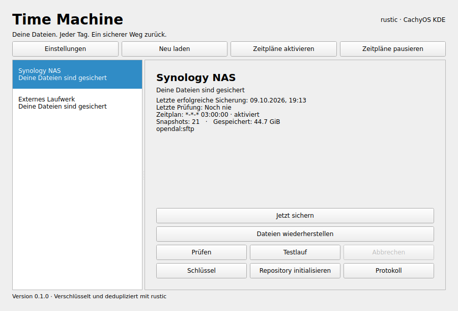

# CachyOS Time Machine · rustic

Dateiversionen für CachyOS KDE, inspiriert von
[Omarchy Time Machine](https://github.com/jankeesvw/omarchy-time-machine).
Die gesamte Backup-Verarbeitung übernimmt **[rustic](https://github.com/rustic-rs/rustic)**.
Die Oberfläche ist eine native **Qt-6-Anwendung** und integriert sich als
**StatusNotifierItem im KDE-Systemabschnitt der Leiste**. Kein restic-Binary,
keine Quickshell-, Omarchy- oder Hyprland-Abhängigkeit.



*Qt-Offscreen-Vorschau mit Beispieldaten. Unter KDE übernimmt das Fenster das aktive Theme.*

## Funktionen

- Ein ruhiges Leisten-Symbol; rot bei Fehlern oder überfälligem Backup,
  blau während eines Vorgangs, orange vor der Einrichtung.
- Mehrere Ziele mit eigenen Zeitplänen, Schlüsseln, Status und Protokollen.
- Automatische Sicherungen mit persistenten systemd-Benutzertimern und
  manuelle Backups aus Fenster, Tray oder Terminal.
- Verschlüsselte, deduplizierte und inkrementelle Backups; jede Sicherung
  ist ein vollständig wiederherstellbarer Dateistand.
- Lokale/externe Laufwerke, NAS, SFTP, S3, REST, rclone und weitere rustic-Backends.
- Eine oder mehrere Quellen, Ausschlussmuster und konfigurierbare Aufbewahrung.
- Fortschritt, Abbruch, Integritätsprüfung, Testlauf und Offline-Statusanzeige.
- Snapshot-Browser mit Datumsauswahl, Verzeichnisnavigation und Textfilter.
  Beim Wechsel des Datums bleibt der aktuelle Pfad erhalten.
- Einzelne Dateien oder ganze Ordner in neue Verzeichnisse unter `~/Restored`
  zurückholen; aktuelle Dateien werden dabei nicht überschrieben.
- Desktop-Benachrichtigungen und Öffnen der Wiederherstellung in Dolphin.
- Passwortdatei oder externer Passwortbefehl; optionaler 1Password-Export.
- Vorbereitungs- und Fehler-Hooks, Protokollaufbewahrung für 30 Tage.

## Installation auf CachyOS KDE

Benötigt Python >= 3.11, Qt/PySide6 >= 6.6 und **rustic >= 0.11.4**.
rustic und PySide6 sind in den Arch-/CachyOS-Paketquellen verfügbar.

```bash
sudo pacman -Syu python-pyside6 rustic libnotify git
git clone https://github.com/xNeo92x/cachyos-timemachine-rustic.git
cd cachyos-timemachine-rustic
python install.py
~/.local/bin/cachyos-time-machine gui
```

Der Installer installiert für deinen Benutzer und benötigt selbst kein sudo.
Er legt einen Menüeintrag und einen KDE-Autostart-Eintrag an. Beim nächsten Login
startet die Anwendung direkt im Systemabschnitt. Fenster schließen blendet sie
aus; **Beenden** im Tray-Menü beendet die Oberfläche. Bereits eingerichtete
systemd-Zeitpläne laufen unabhängig davon weiter.

Falls KDE das Symbol ausblendet: Rechtsklick auf den **Systemabschnitt** →
**Systemabschnitt einrichten** → **Einträge** → **CachyOS Time Machine** →
**Immer angezeigt**. Das Symbol nutzt die Textfarbe des aktiven Qt-Themes;
Fenster und Bedienelemente übernehmen das KDE-/Qt-Theme.

Optional als Arch-Paket statt Benutzerinstallation:

```bash
cd packaging
makepkg -si
```

Bei Paketinstallation den Autostart über KDE **Systemeinstellungen → Autostart**
hinzufügen (`cachyos-time-machine gui --tray`).
Das PKGBUILD ist im Repository enthalten; eine Veröffentlichung im AUR ist damit
nicht verbunden.

## Erste Sicherung

1. Im Fenster **Einstellungen** öffnen. Quellen und ein oder mehrere Ziele
   festlegen. Der Starterpfad `CHANGE-ME` muss ersetzt werden.
2. **Schlüssel → Schlüssel speichern**. Passwort zusätzlich außerhalb des PCs
   sichern, beispielsweise in einem Passwortmanager.
3. **Repository initialisieren**, dann **Jetzt sichern**.
4. **Zeitpläne aktivieren**. Speichern der Einstellungen schreibt und aktiviert
   ebenfalls die Zeitpläne neu. Fehler dabei werden angezeigt.

Der Schlüssel liegt standardmäßig unter
`~/.config/cachyos-time-machine/keys/NAME.password` mit Dateirechten **0600**.
Er gelangt weder in die Prozessargumente noch in die Protokolle und wird vom
Backup ausgeschlossen. Die lokale Passwortdatei ist nicht zusätzlich durch
KWallet verschlüsselt; sie entspricht dem unbeaufsichtigten Datei-Modell des
Originals. Mit `password_command` kann ein externer Schlüsselspeicher verwendet
werden, sofern er auch im systemd-Benutzerkontext ohne Eingabe erreichbar ist.

## Konfiguration

`~/.config/cachyos-time-machine/config.json`:

```json
{
  "source": ["~"],
  "exclude_file": "excludes.txt",
  "stale_hours": 48,
  "retention": {"daily": 7, "weekly": 4, "monthly": 12, "yearly": 3},
  "destinations": [
    {
      "name": "usb",
      "display_name": "Mein Backup-Laufwerk",
      "repository": "/run/media/DEIN-BENUTZER/Backup/rustic",
      "schedule": "*-*-* 03:00:00"
    }
  ]
}
```

`source` kann auch eine einzelne Zeichenkette sein. Jede Quelle muss vorhanden
sein, sonst schlägt die Sicherung insgesamt fehl. Es wird als normaler Benutzer
gesichert; z. B. ein Backup von `/etc` umfasst nur lesbare Dateien. Dies ist ein
Dateibackup mit Versionshistorie, kein bootfähiges Systemabbild.

| Option | Bedeutung |
| --- | --- |
| `name` | Eindeutiger Zielname: Buchstaben/Ziffern, `-` oder `_` |
| `display_name` | Anzeigename, standardmäßig `name` |
| `repository` | Lokaler Pfad oder native rustic-Backendangabe |
| `schedule` | systemd-OnCalendar; leer/fehlend bedeutet nur manuell |
| `retention` | Globale oder zielbezogene Aufbewahrung; mindestens ein positiver Wert |
| `stale_hours` | Warnschwelle seit letzter erfolgreicher Sicherung, global oder je Ziel |
| `pre_command` | Ziel vorbereiten, z. B. Mount-Service starten; auch vor Browser/Prüfung/Init |
| `on_failure_command` | Bei fehlgeschlagenem Backup ausführen |
| `hook_timeout` | Hook-Zeitlimit in Sekunden, standardmäßig 120 |
| `password_file` | Alternative Passwortdatei, muss Rechte 0600 besitzen |
| `password_command` | Alternativer rustic-Passwortbefehl; nicht zusammen mit `password_file` |
| `options` | String-Werte für rustic `[repository.options]` |
| `env_file` | Pfad einer JSON-Datei mit Umgebungsvariablen für dieses Ziel |
| `env` | Direkt definierte Umgebungsvariablen für dieses Ziel |

Eigene Hook-Befehle werden ausdrücklich über `/bin/sh -c` als dein Benutzer
ausgeführt. Ein Testlauf führt keine Hooks aus und schreibt keinen Snapshot.

### NAS über SFTP

```json
{
  "name": "nas",
  "display_name": "Synology NAS",
  "repository": "opendal:sftp",
  "options": {
    "endpoint": "ssh://192.168.178.121:22",
    "user": "backupuser",
    "root": "/volume1/backup/rustic"
  },
  "schedule": "*-*-* 03:00:00"
}
```

Der native SFTP-Backend benötigt funktionierende SSH-Schlüsselauthentifizierung;
Zugang und Backend-Unterstützung mit der installierten rustic-Version prüfen.
Alternativ ein NAS per SMB/NFS als echtes Dateisystem einhängen und den lokalen
Mount-Pfad als Repository nutzen, oder `rclone:REMOTE:pfad` konfigurieren.
Eine `smb://`-Adresse aus Dolphin ist kein lokal eingehängter Verzeichnispfad.
restic-URLs wie `sftp:user@host:/pfad` werden bewusst mit einer Erklärung
abgelehnt; rustic verwendet eine andere Backend-Konfiguration.

### S3

```json
{
  "name": "offsite",
  "repository": "opendal:s3",
  "options": {
    "bucket": "mein-backup-bucket",
    "region": "eu-central-1",
    "root": "cachyos"
  },
  "env_file": "~/.config/cachyos-time-machine/offsite-env.json",
  "schedule": "*-*-* 04:00:00"
}
```

`offsite-env.json` (private Rechte 0600 setzen):

```json
{
  "AWS_ACCESS_KEY_ID": "DEIN-ZUGANGSSCHLUESSEL",
  "AWS_SECRET_ACCESS_KEY": "DEIN-GEHEIMER-SCHLUESSEL"
}
```

Zugangsdaten-Dateien und alternative Passwortdateien werden automatisch vom
Backup ausgeschlossen. Backend-Optionen richten sich nach rustic/OpenDAL;
mehr Beispiele: [rustic-Konfigurationen](https://github.com/rustic-rs/rustic/tree/main/config/services).

### Ausschlüsse

`excludes.txt` verwendet **rustic-Globs**. Wichtig: `!` bedeutet hier **ausschließen**,
positive Muster bedeuten **einschließen**. Positive Muster können alle anderen
Dateien implizit ausschließen; beim Ausschließen daher das `!` nicht vergessen.

```text
# Native rustic-Globs
!.cache/
!.local/share/Trash/
!Downloads/
!*.iso
```

Die App hängt Schutzmuster für Repository-Verzeichnisse, lokale Schlüssel,
Umgebungsdateien, Status/Protokolle, `~/Restored` und den rustic-Cache zuletzt an.
Sie sollen weder in die Sicherung geraten noch ein rekursives Backup des
Backup-Repositorys erzeugen.

### Zeitplanung und Aufbewahrung

Nach manueller Änderung von `config.json` im Fenster **Neu laden** und
**Zeitpläne aktivieren** wählen, oder `cachyos-time-machine install` ausführen.
Die App merkt den zuletzt selbst gesetzten Aktivierungszustand; für außerhalb
der App geänderte Timer ist `systemctl --user list-timers` maßgeblich.

`Persistent=true` holt verpasste Termine nach, sobald der Benutzer-Service-Manager
wieder läuft. Es weckt den PC nicht aus dem Standby und garantiert keine
Ausführung bei ausgeschaltetem Gerät. Für Betrieb ohne angemeldete Sitzung kann
bei Bedarf `loginctl enable-linger "$USER"` verwendet werden; externe Laufwerke,
SSH-Agent und Secrets müssen dann ebenfalls ohne Desktop-Sitzung verfügbar sein.

Aufbewahrung läuft nur nach einem vollständig erfolgreichen Backup und filtert
nach dem App-Snapshotlabel `cachyos-time-machine`. Andere Snapshotlabels werden
nicht durch diese Regel gelöscht. rustic entfernt ungenutzte Daten mit seinen
eigenen Prune-Regeln; dadurch muss der Speicher nicht sofort sinken.
Bereinigungsfehler werden getrennt angezeigt, ohne den erfolgreichen Datenstand
als verlorenes Backup zu behandeln. Warnungen von rustic zählen vorsorglich als
unvollständiger Backup-Lauf; dann wird keine Aufbewahrung ausgeführt.

## Wiederherstellung

**Dateien wiederherstellen** → Datum auswählen → Ordner öffnen → Datei oder
Ordner wiederherstellen. Pfeile und Enter navigieren, Tippen filtert die Liste,
`Ctrl+F` fokussiert den Filter, `Alt+Pfeil hoch` öffnet den übergeordneten Ordner.

Jeder Restore erzeugt einen eigenen privaten Ordner, beispielsweise:
`~/Restored/2026-10-09_18-30-00_ab12cd34/home/eugen/Dokumente/datei.txt`.
Auch mit CLI-`--target` wird darunter ein neuer Unterordner angelegt.
Beim Wiederherstellen einer Datei öffnet die Benachrichtigungsaktion den
zugehörigen Ordner. Die Dateien kannst du anschließend selbst zurück verschieben.

## Terminal

Falls `~/.local/bin` noch nicht im PATH ist, die vollständige Programmadresse nutzen.

```bash
cachyos-time-machine configure
cachyos-time-machine key set --dest usb
cachyos-time-machine init --dest usb
cachyos-time-machine install
cachyos-time-machine backup --dest usb
cachyos-time-machine backup --dest usb --dry-run
cachyos-time-machine check --dest usb
cachyos-time-machine snapshots --dest usb --json
cachyos-time-machine ls --dest usb --snapshot SNAPSHOT_ID --path /home/eugen --json
cachyos-time-machine restore --dest usb --snapshot SNAPSHOT_ID --path /home/eugen/Dokumente
cachyos-time-machine cancel --dest usb
cachyos-time-machine destinations --json
cachyos-time-machine stats --dest usb
cachyos-time-machine log --dest usb
cachyos-time-machine pause
cachyos-time-machine key show --dest usb
cachyos-time-machine key save-1password --dest usb
cachyos-time-machine key save-1password --dest usb --vault Privat
systemctl --user list-timers 'cachyos-time-machine-*'
```

Repositorybefehle liefern JSON und Exitcode 0/1. `key show`, `configure` und
`log` ohne `--json` liefern Klartext. Globale Optionen `--config-dir` und
`--state-dir` stehen vor dem Unterbefehl.

## Entwicklung und Tests

```bash
python -m venv .venv
source .venv/bin/activate
pip install -e . pytest ruff
python -m ruff check timemachine tests install.py
QT_QPA_PLATFORM=offscreen python -m pytest -q
```

`RUSTIC_TEST_BINARY=/pfad/zu/rustic` wählt ein separates Testbinary.
Ohne rustic werden nur die Integrationstests übersprungen.
Die GitHub-Actions-Konfiguration installiert rustic 0.11.4 mit festem SHA256 und
führt ebenfalls echte Backup-/Restore-Tests aus. Testrepositories sind temporär;
deine persönlichen Daten und Backups werden nicht verwendet.

Getestet: echte lokale Repository-Initialisierung, inkrementelle Sicherung,
Snapshot-Historie, Ordner-/Datei-Restore, Unicode-Dateinamen, Ausschlüsse, Testlauf,
Prüfung, falsches Passwort, Abbruch, konkurrierende Zugriffe und Qt-Browserprozesse.
Die GUI wurde im Qt-Offscreen-Modus geprüft. Eine vollständige CachyOS-/KDE-
Wayland-Sitzung, echte NAS-/Cloud-Ziele und 1Password standen hier nicht für
Integrationstests zur Verfügung. Version 0.1.0 ist eine erste Implementierung.

## Aktualisieren und Entfernen

Für Benutzerinstallation: `git pull`, `python install.py`, anschließend
`~/.local/bin/cachyos-time-machine install`, um Timer neu zu schreiben.
Vor Aktualisierung die Oberfläche beenden und laufende Vorgänge abschließen.

```bash
python install.py --uninstall
```

Die Anwendung und ihre Timer werden entfernt. Konfiguration, Schlüssel,
Protokolle und die Backup-Repositories bleiben erhalten. Ein manuell über KDE
angelegter Autostart-Eintrag muss dort separat entfernt werden.

MIT. Herkunft und technische Portierungsdetails: [docs/UPSTREAM.md](docs/UPSTREAM.md).
